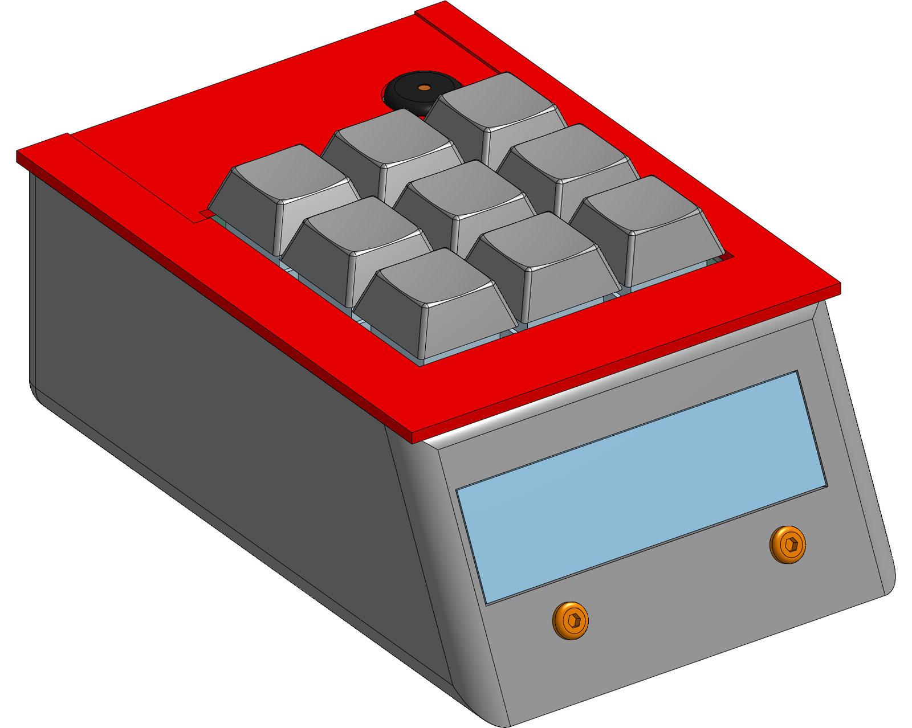
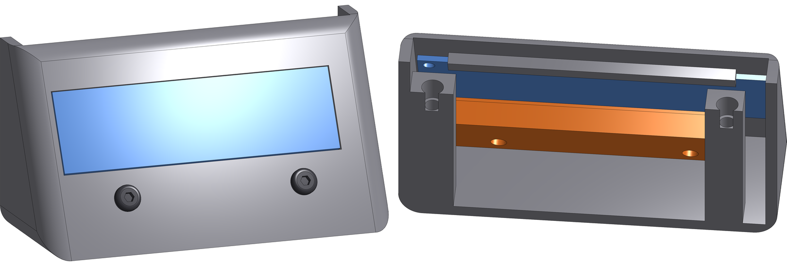
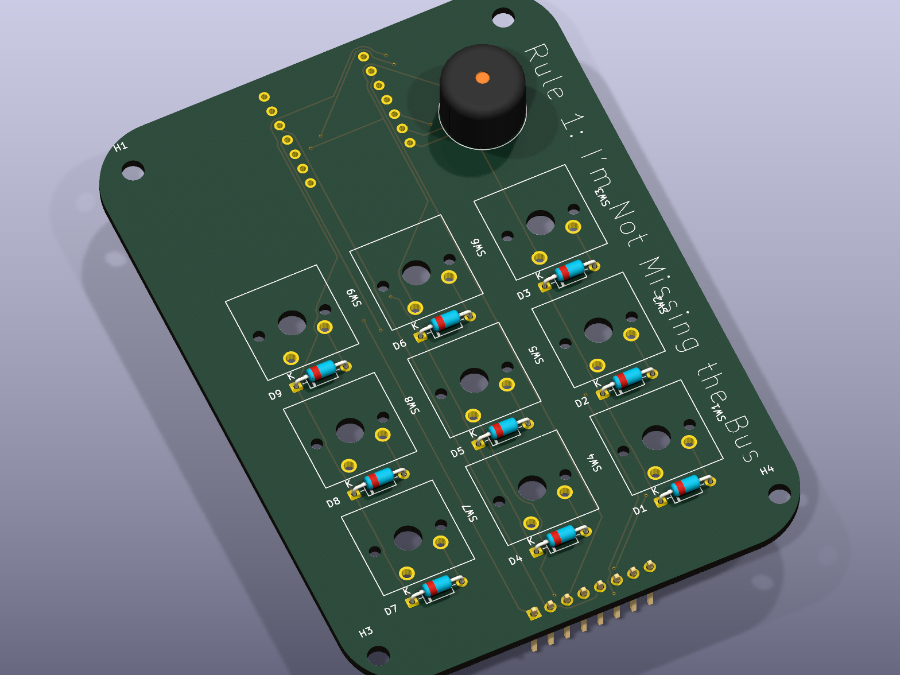
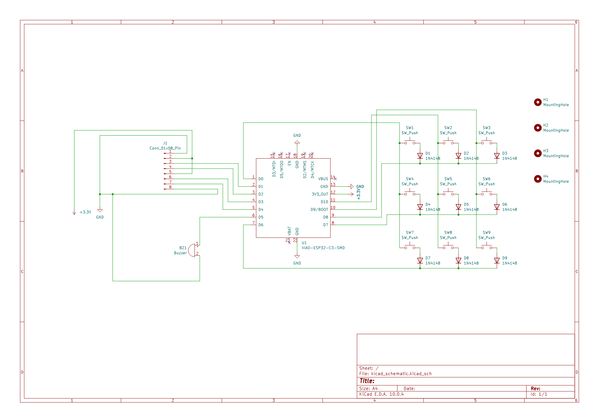

# NotGoingToBeLateToSchool

a 9 key alarm clock that makes you type a code to shut it up.

built on a xiao esp32c3 for BLARE. during the day it sits on my desk cycling through
weather, hackatime hours, now playing and world clocks. at 6am it tells my phone to start
playing spotify instead of screaming at me with a piezo. you get 3 snoozes, and on the 3rd
one you have to type a code on the keypad before it stops.

every alarm clock i've had is useless for the 16 hours a day you're awake, and way too easy
to snooze into oblivion. this one tries to fix both.

the display lives inside the case, flat against the inner face of the slanted front wall with
its glass poking out through the window. its top edge slides under a lip printed on the wall,
and a printed rail clamps the bottom edge. two m3x8 screws go in through the front of the case
into heatset inserts in that rail, so they are the only screws you see. the display's own tiny
mounting holes are not used at all.

## what it does

**ambient**, all day

- auto rotates through weather / hackatime hours / now playing / world clocks
- spinning globe on the clock face, same animation as the oled on my hackpad
- one small json from a relay covers all four pages, so the clock makes one https request
  a minute instead of juggling four apis itself

**alarm**, at 6am

- multiple alarms, each with its own days of the week, all editable on the device
- 3 snoozes max. the first two are normal, on the 3rd it drops into code entry and keeps
  going until you type the right code
- screen fades up from near black to full brightness over the 15 min before the alarm
- escalating piezo buzzer that speeds up the longer you ignore it

**ble**, written and compiling, never run on hardware

- pairs as a ble media remote so the alarm hits play on my phone instead of buzzing
- iphone notifications over ancs

## the board

69.5 x 97mm, 2 layers, 25 footprints. 461 tracks, 14 vias, about 1.5m of copper. drc clean,
nothing unrouted.

- keys on the top side at 19.05 pitch so the caps clear each other
- xiao and display header on the underside, so the top face is just keycaps and the buzzer
- xiao at the back with usb-c out the rear, on 2.54 sockets so it can be pulled out
- 8 pin display header at the front edge so the jumper run to the screen is short
- one diode per switch, sitting in the 3.45mm gap directly below it
- 4x m3 mounting holes, pushed out to the corners so they clear the key block

nine switches in a 3x3 matrix, one 1n4148 per key so holding two keys down cannot ghost a
third.

