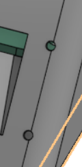

# NotGoingToBeLateToSchool

a 9 key alarm clock that makes you type a code to shut it up.

built on a xiao esp32c3 for BLARE. during the day it sits on my desk cycling through weather, hackatime hours, now playing and world clocks. at 6am it tells my phone to start playing spotify instead of screaming at me with a piezo. you get 3 snoozes, and on the 3rd one you have to type a code on the keypad before it stops.

the display screws down through its own two mounting holes, 16.26 apart, into
blind pilots in the slanted face. it seats on the wall around the window rather
than floating in it.

## why

every alarm clock i've had is useless for the 16 hours a day you're awake, and way too easy
to snooze into oblivion. this one tries to fix both.

## what it does

ambient stuff:
- auto rotates through weather / hackatime hours / now playing / world clocks
- spinning globe on the clock face, same animation as the oled on my hackpad
- all the network data comes in as one small json from a relay, so the clock only makes one
  https request a minute instead of juggling four apis itself

ble stuff, compiles clean but has never run on hardware:
- pairs as a ble media remote so the alarm hits play on my phone instead of buzzing
- iphone notifications over ancs
- build it on **Minimal SPIFFS**. with ble on the sketch is 1394487 bytes, which is 106% of
  the default partition and will not fit. minimal spiffs puts it at 70% and keeps ota

alarm stuff:
- multiple alarms, each with its own days of the week, all editable on the device
- 3 snoozes max. first two are normal, on the 3rd it goes into code entry and keeps going
  until you type the right code
- screen fades up from near black to full brightness starting ~15 min before the alarm.
  fake sunrise
- escalating piezo buzzer that speeds up the longer you ignore it

controls:
- 9 mx switches in a 3x3 matrix on top of the case
- 2.25in st7789 on the front face
- normally a menu pad, in code entry the keys become a number pad

## pics

### schematic

nine switches in a 3x3 matrix, one 1n4148 per key so holding two keys down cannot
ghost a third. rows on d0 d9 d10, columns on d6 d7 d8.

### pcb

keys live on the front, everything else is on the back so the case only shows keycaps.
the buzzer is the one exception, it stays on the key side under the top plate.

## how it works

the xiao has exactly 11 gpio and this uses every single one. that constraint shaped basically
the whole board.

| what | pins |
|---|---|
| buzzer | 1 |
| tft (sclk, sda, dc, cs) | 4 |
| matrix rows | 3 |
| matrix cols | 3 |
| **total** | **11 / 11** |

got 2 pins back by tying the display's `rst` to 3v3 and `bl` to gnd, which is what the blare
docs say to do when you run out. downside is no hardware brightness control, so the sunrise
ramp is done in software with a dimming palette instead of pwm.

the 3x3 matrix gets 9 keys out of 6 pins using 9 of the 12 diodes in the kit. firmware drives
one column low at a time and reads the three rows.

### pin map

| pad | gpio | net |
|---|---|---|
| d0 | 2 | ROW1 |
| d1 | 3 | TFT_SCLK |
| d2 | 4 | TFT_SDA |
| d3 | 5 | TFT_DC |
| d4 | 6 | TFT_CS |
| d5 | 7 | BUZZER |
| d6 | 21 | COL1 |
| d7 | 20 | COL2 |
| d8 | 8 | COL3 |
| d9 | 9 | ROW3 |
| d10 | 10 | ROW2 |

rows are gpio2, gpio9 and gpio10, columns are gpio21, gpio20 and gpio8. gpio8 and gpio9 are
strapping pins and both have to read high at boot. the rows use internal pull ups and the
columns are hi-z until setup runs, so a key held down at power on can only ever pull a line
up through its diode, never down. no external pull ups needed.

## the board

69.5 x 97mm, 2 layers, 25 footprints. 461 tracks, 14 vias, about 1.5m of copper. drc clean,
nothing unrouted.

- keys on the top side at 19.05 pitch so the caps clear each other
- xiao and display header on the underside, so the top face is just keycaps and the buzzer
- xiao at the back with usb-c out the rear, on 2.54 sockets so it can be pulled out
- 8 pin display header at the front edge so the jumper run to the screen is short
- one diode per switch, sitting in the 3.45mm gap directly below it
- 4x m3 mounting holes, pushed out to the corners so they clear the key block

board sits flat under the top deck and the screen mounts on the front face, so they're on
different planes and nothing on the pcb has to stay clear for the display.

## the case

two printed parts, base and a separate top plate.

- raked shell so the screen sits at a readable angle instead of flat on the desk
- pcb sits on 4 posts with m3x5x4 heatset inserts
- 17mm of clear height under the board, because the xiao is socketed and hangs
  15.24mm below it. that one number sets the whole case depth
- top plate is 2mm with a 58mm square cutout for the keys. glued on, not screwed
- screen mounts on the slanted front face and jumpers back to the 8 pin header,
  so the board and the screen sit on different planes and neither has to dodge
  the other
- usb-c out the back, buzzer holes in the top plate

## bom

from the kit:

| qty | part |
|---|---|
| 1 | seeed xiao esp32c3 |
| 9 | mx style switches |
| 9 | blank dsa keycaps |
| 9 | 1n4148 diodes |
| 1 | 2.25in st7789 tft, 284x76 |
| 1 | 3.3v piezo buzzer |
| 1 | 8 pin 2.54mm male header |
| 8 | 20cm f-f jumper wires |
| 8 | m3x5x4 heatset inserts |
| 4 | m3x8mm screws |
| 4 | m3x16mm screws |

unused from the kit: 3 switches, 3 keycaps, 3 diodes.

sourced separately: nothing electrical. only thing outside the kit is filament for the case.

## repo

| path | what |
|---|---|
| `PCB/` | kicad project, gerbers + drill (loose and zipped), board step |
| `CAD/` | assembly step, stls, onshape link |
| `firmware/` | arduino sketch |
| `images/` | renders used in this readme |

kicad project is in `PCB/kicad_schematic/`. gerbers and the drill file are in `PCB/gerber/`. `PCB/gerbers.zip` is the same
thing zipped, ready to drop straight into jlcpcb.
